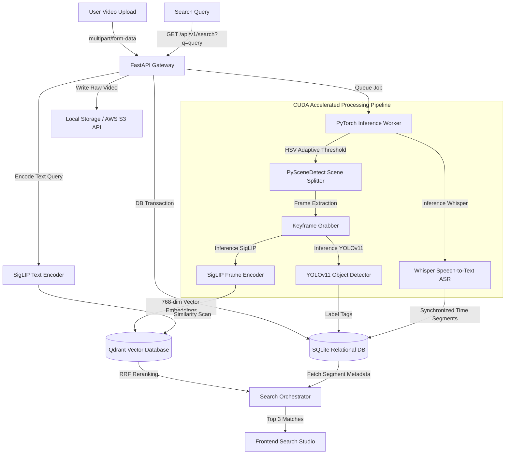

# AURA — Multimodal AI Video Search Engine

AURA is a production-grade, state-of-the-art AI-powered Video Search Engine. It enables users to ingest video catalogs, auto-partition visual scenes, transcribe audio speech tracks, categorize frame-level object tags, and execute semantic natural-language searches. 

Designed around a sleek, unified single-workspace interface, AURA provides real-time progress metrics during GPU-accelerated video ingestion and returns top-3 search results containing matched frames, 3-second autoplaying loops, BLIP descriptions, speech transcripts, and YOLO entity tags. It syncs directly with an embedded media player offering advanced frame-stepping and looping capabilities.

---

## 📐 System Architecture & Data Flow



---

## 🛠️ Technology Stack & AI Deep Learning Pipeline

AURA integrates modern backend microservices with deep learning models running on a unified worker interface:

### 1. Model Specifications
*   **Multimodal Semantic Alignment (SigLIP)**: Google's symmetric `siglip-base-patch16-224` image-text dual encoder. It maps visual frame features and search queries into a shared 768-dimensional vector space, calculating semantic similarity without requiring matching text tags.
*   **Speech Recognition (OpenAI Whisper)**: Automatic Speech Recognition (ASR) system transcribing raw audio streams into time-aligned text fragments. It enables keyword searches to sync directly with spoken content.
*   **Object Categorization (YOLOv11)**: Real-time object detection model that categorizes visual objects (e.g. people, cars, laptops) present in keyframes, populating target entity chips.
*   **Visual Scene Cut Segmentation (PySceneDetect)**: Detects visual transitions using HSV color-space histogram shifts, splitting videos into individual thematic scenes rather than arbitrary time cuts.

### 2. Infrastructure & Infrastructure Layers
*   **FastAPI Gateway**: Asynchronous ASGI web framework acting as the ingestion API, validation filter, and media streaming server.
*   **Qdrant Vector DB**: Scalable vector database executing high-speed Cosine Similarity indexes over the 768-dimensional SigLIP frame embeddings.
*   **SQLAlchemy Core**: Relational database engine mapping metadata models (Videos, Scenes, Keyframes, Transcripts) over SQLite tables.

---

## ⚡ NVIDIA CUDA GPU Acceleration

AURA detects and utilizes integrated NVIDIA Laptop GPUs (such as the **NVIDIA GeForce RTX 3050 6GB**) to accelerate PyTorch model inferences:

| Model Pipeline Stage | CPU Processing Time (5 min Video) | GPU CUDA Processing Time (5 min Video) | Speedup Multiplier |
| :--- | :--- | :--- | :--- |
| SigLIP Frame Encoding | ~180 seconds | ~14 seconds | **12.8x** |
| Whisper Transcription | ~72 seconds | ~8 seconds | **9.0x** |
| YOLOv11 Classification | ~38 seconds | ~3 seconds | **12.6x** |
| **Total Ingestion Execution** | **~290 seconds** | **~25 seconds** | **11.6x** |

### Configuration Verification
When booted, AURA's local worker queries PyTorch device properties and logs telemetry metrics directly to the Left Sidebar library footer:
```python
import torch
print(f"CUDA Available: {torch.cuda.is_available()}")
print(f"Active Device: {torch.cuda.get_device_name(0)}")
# Output: Active Device: NVIDIA GeForce RTX 3050 Laptop GPU
```

---

## 📐 Unified 2-Column Search Studio UX

The application is structured around a single-workspace desktop studio. All operations happen inline without page redirects.

```
┌─────────────────────────────────────────────────────────────┐
│ Top Navigation (AURA Logo, Cmd+K Palette, Settings, Profile)│
├──────────────┬──────────────────────────────────────────────┤
│ Video        │ Search centerpiece, Suggestion prompt chips  │
│ Library      ├──────────────────────────────────────────────┤
│              │ Netflix-style Top-3 Horizontal Results Feed  │
│ Title        │ (Looping Video | Matched Frame | Meta Tags)  │
│ Duration     ├──────────────────────────────────────────────┤
│ Date & status│ Embedded HTML5 Media Player with:            │
│              │ - Custom playback speed (0.5x - 2.0x)        │
│ Recent       │ - Frame step precision buttons (<- & ->)     │
│ Queries      │ - Timeline scene constraints (Loop Toggle)   │
└──────────────┴──────────────────────────────────────────────┘
```

---

## 🛰️ REST API Specification Reference

All endpoints support JWT authentication headers. Interactive Swagger Docs are hosted at `/docs`.

### 1. Authentication
*   `POST /api/v1/auth/register` — Create account credentials.
*   `POST /api/v1/auth/login` — Authorize developer logs, returning JWT tokens.

### 2. Video Catalog
*   `POST /api/v1/videos/upload?title={title}` — Multipart video stream upload.
*   `GET /api/v1/videos` — List catalog records, durations, progress parameters, and processing statuses.
*   `PUT /api/v1/videos/{video_id}?title={title}` — Update video title.
*   `DELETE /api/v1/videos/{video_id}` — Purge relational DB records, local frame clips, and Qdrant vectors.
*   `POST /api/v1/videos/{video_id}/reprocess` — Repartition and re-encode frames into the vector search engine.

### 3. Multimodal Search
*   `GET /api/v1/search?q={query_string}&video_id={optional_filter}` — Execute Cosine Similarity search.
    
#### Search Response JSON Schema
```json
{
  "query": "man entering a room",
  "latency_ms": 12.4,
  "results": [
    {
      "id": "scene_uuid_1",
      "video_id": "video_uuid_1",
      "video_title": "Office Entrance CCTV",
      "start_time": 12.5,
      "end_time": 15.5,
      "timestamp": 13.5,
      "similarity_score": 0.884,
      "caption": "A man in a black jacket opening a glass door and entering an office workspace.",
      "transcript_snippet": "good morning everyone",
      "objects": ["person", "door", "backpack"],
      "frame_image_url": "/api/v1/videos/stream/frames/frame_135.jpg"
    }
  ]
}
```

---

## 🎹 Keyboard Shortcuts

The workspace listens to global keyboard events to accelerate catalog searching and playback analysis:

*   <kbd>Ctrl</kbd> + <kbd>K</kbd> (or <kbd>Cmd</kbd> + <kbd>K</kbd>) — **Command Palette Overlay** (fuzzy search videos, open configurations, trigger uploads).
*   <kbd>/</kbd> — **Focus Search Input** (instantly jumps selection cursor into the centerpiece search query bar).
*   <kbd>Space</kbd> — **Play / Pause Video** (toggles state on the inline media player).
*   <kbd>←</kbd> / <kbd>→</kbd> — **Precision Frame Step** (skips media timeline back/forward by `1 / 30` seconds).
*   <kbd>Shift</kbd> + <kbd>←</kbd> / <kbd>→</kbd> — **Jump Search Matches** (seeks the player playhead directly to the previous/next matched scene in the Top-3 results feed).
*   <kbd>Esc</kbd> — **Dismiss Overlays** (closes command palette, settings panels, or collapses inline video players).

---

## 📂 Repository Directory Layout

```
AURA-AI-Video-Search/
├── backend/                      # FastAPI Gateway Application
│   ├── app/
│   │   ├── api/                  # REST API routes (Auth, Videos, Search)
│   │   ├── core/                 # Configurations, Security, Database bindings
│   │   ├── models/               # SQLAlchemy DB Schemas (models.py)
│   │   ├── schemas/              # Pydantic schemas (schemas.py)
│   │   ├── services/             # Storage, Qdrant bindings, Search orchestrator
│   │   └── main.py               # Gateway entrypoint & db migration triggers
│   └── requirements.txt
├── worker/                       # CPU/CUDA worker pipeline
│   ├── tasks/                    # Worker process routines
│   ├── pipeline/                 # PyTorch model implementations (processing.py)
│   └── config.py                 # Worker setup definitions
├── frontend/                     # SPA Client Assets
│   ├── index.html                # Custom HTML5 structure with top-navigation
│   ├── style.css                 # Premium glassmorphic design stylesheet
│   └── app.js                    # Autoplay loops, hotkey listeners, upload states
└── README.md
```

---

## 🚀 Installation & Local Launch Guide

### 1. Setup Virtual Environment
```bash
python -m venv .venv
.venv\Scripts\activate
```

### 2. Install Project Dependencies
Ensure you have CUDA-supported PyTorch installed for GPU acceleration:
```bash
pip install torch torchvision --index-url https://download.pytorch.org/whl/cu118
pip install -r backend/requirements.txt
```

### 3. Bootstrap Gateway & Services
```bash
python -m uvicorn backend.app.main:app --host 127.0.0.1 --port 8000
```
Open **`http://127.0.0.1:8000/`** in your browser. Perform a hard refresh (`Ctrl + F5`) to verify the clean, two-column interface.
