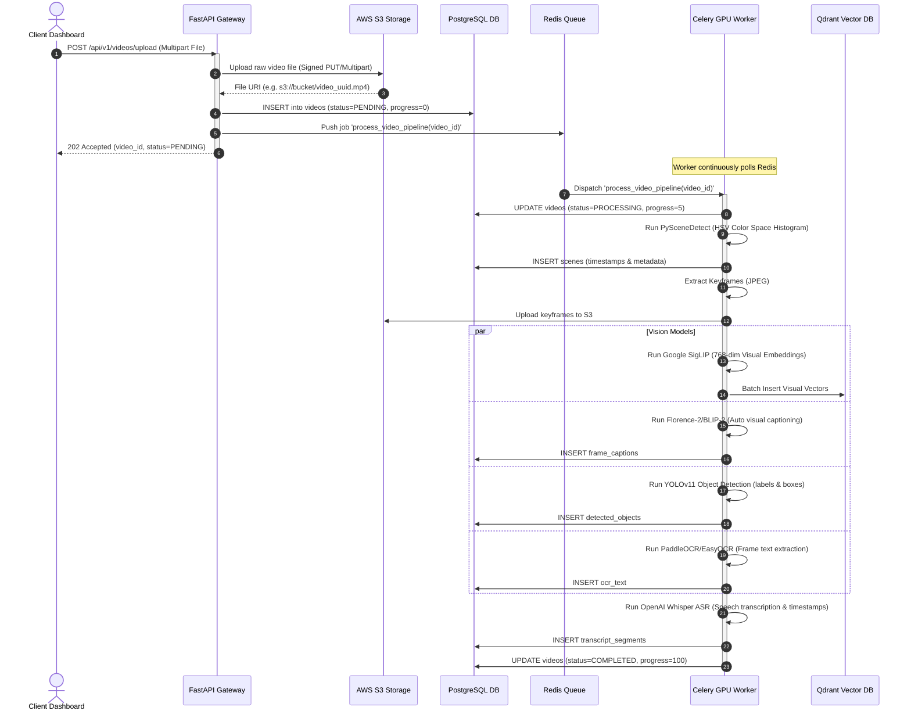
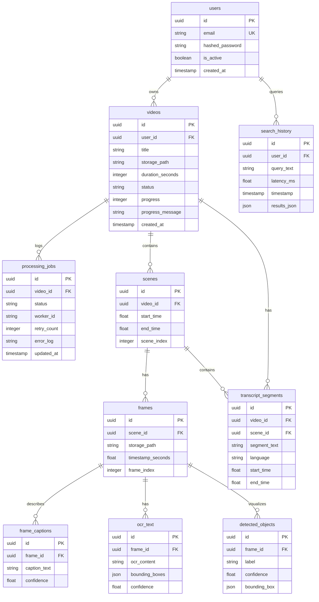
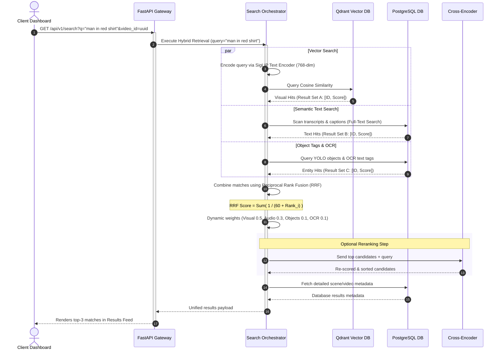

# AURA — Multimodal AI Video Search Engine: System Architecture Design

This document details the production-grade architecture design of the **AURA Multimodal AI Video Search Engine**. The system is built for high-throughput video ingestion, parallelized CUDA deep learning model inference, hybrid retrieval indexing, and low-latency query reranking.

---

## 1. High-Level System Architecture

AURA separates synchronous HTTP request serving from heavy GPU neural-network inference using a message broker and asynchronous execution queues.

```
                  ┌────────────────────────────────────────┐
                  │          Internet (Client SPA)         │
                  └───────────────────┬────────────────────┘
                                      │
                                      ▼ [HTTPS / WSS / API]
                  ┌────────────────────────────────────────┐
                  │             Nginx Gateway              │
                  └───────────────────┬────────────────────┘
                                      │
                                      ▼ [Load Balanced]
                  ┌────────────────────────────────────────┐
                  │            FastAPI Gateway             │
                  └────────┬──────────┬──────────┬─────────┘
                           │          │          │
        [Metadata Storage] │          │          │ [Object Storage]
                           ▼          │          ▼
            ┌──────────────┴───┐      │      ┌───┴──────────────┐
            │    PostgreSQL    │      │      │  AWS S3 Bucket   │
            │  Relational DB   │      │      │  (Raw & Frames)  │
            └──────────────────┘      │      └──────────────────┘
                                      ▼ [Job Dispatcher]
                  ┌────────────────────────────────────────┐
                  │          Redis Message Queue           │
                  └────────┬────────────────────┬──────────┘
                           │                    │
                           ▼ [Parallel CUDA]    ▼ [Parallel CUDA]
                  ┌────────┴─────────┐    ┌─────┴────────────┐
                  │  Celery Worker 0 │    │  Celery Worker 1 │
                  │  (GPU Device 0)  │    │  (GPU Device 1)  │
                  └────────┬─────────┘    └─────┬────────────┘
                           │                    │
                           └──────────┬─────────┘
                                      ▼ [Embedding Inserts]
                  ┌────────────────────────────────────────┐
                  │             Qdrant Vector             │
                  │            Database Index            │
                  └────────────────────────────────────────┘
```

---

## 2. Asynchronous Video Ingestion Sequence Diagram

The following sequence details how the system ingests a video, offloads heavy deep learning processes asynchronously, and streams updates back to the database.



---

## 3. Database Layer: Entity-Relationship Schema (PostgreSQL)

This schema represents the production PostgreSQL design, which extends the SQLite schema with OCR content, text indices, job tracking, and authentication tables.



---

## 4. Multi-Modal AI Processing Pipeline

AURA's inference worker is built for batched CUDA pipeline execution to prevent GPU context switching overheads.

```
                      ┌────────────────────────┐
                      │    Raw Video Stream    │
                      └───────────┬────────────┘
                                  │
                                  ▼
                      ┌────────────────────────┐
                      │     PySceneDetect      │ (Scene segment boundaries)
                      └───────────┬────────────┘
                                  │
                                  ▼
                      ┌────────────────────────┐
                      │   Keyframe Extractor   │ (Representational JPEGs)
                      └─────┬────────────┬─────┘
                            │            │
            ┌───────────────┘            └───────────────┐
            ▼ (Audio Track)                              ▼ (Visual Frames)
┌───────────────────────┐                    ┌───────────────────────┐
│  OpenAI Whisper ASR   │                    │      SigLIP Base      │ (768-dim Visual
│ (Speech-to-text cuts) │                    │  (Google Patch16-224) │  dense vectors)
└───────────┬───────────┘                    └───────────┬───────────┘
            │                                            │
            ▼                                            ▼
┌───────────────────────┐                    ┌───────────────────────┐
│ Multilingual Rerank   │                    │     Florence-2 /      │ (Detailed natural
│   (Language Translate)│                    │        BLIP-2         │  scene summaries)
└───────────┬───────────┘                    └───────────┬───────────┘
            │                                            │
            │                                            ▼
            │                                ┌───────────────────────┐
            │                                │       YOLOv11         │ (Visual object
            │                                │  (Object Detections)  │  boundary boxes)
            │                                └───────────┬───────────┘
            │                                            │
            │                                            ▼
            │                                ┌───────────────────────┐
            │                                │ PaddleOCR / EasyOCR   │ (Text extracted
            │                                │  (Video frame text)   │  from scenes)
            │                                └───────────┬───────────┘
            │                                            │
            ▼                                            ▼
┌────────────────────────────────────────────────────────────────────┐
│                       Search Orchestrator                          │
│        (Metadata Ingestion to PostgreSQL & Vectors to Qdrant)      │
└────────────────────────────────────────────────────────────────────┘
```

---

## 5. Hybrid Search & Reranking Sequence Diagram

To resolve multi-modal retrieval matching, AURA implements **Hybrid Search** with a weighted score calculation, utilizing **Reciprocal Rank Fusion (RRF)** and an optional **Cross-Encoder Reranker**.



---

## 6. Technology Justification

| Technology | Production Alternative | Reason for Selection |
| :--- | :--- | :--- |
| **FastAPI** | Express.js / Django | Native asynchronous async/await event loops, typing validation via Pydantic, and automatic Swagger generation. |
| **Celery + Redis** | RabbitMQ / AWS SQS | Celery handles distributed Python code execution natively. Redis works both as a high-speed message broker and status database cache. |
| **PostgreSQL** | SQLite / MySQL | Supports production-level concurrent writing, ACID transactional guarantees, JSONB fields for YOLO coordinate storage, and pg_trgm for full-text search. |
| **Qdrant** | Pinecone / Milvus | Open-source, rust-based, supports payload filtering directly during vector scan, and includes in-memory mode for fast testing. |
| **SigLIP** | CLIP (OpenAI) | Google's SigLIP uses a sigmoid loss that optimizes image-text pairs individually, showing higher retrieval accuracy on complex descriptions. |
| **Florence-2** | BLIP-1 | Unified visual-language transformer. Generates highly descriptive image captions, coordinates OCR boundary tags, and localizes visual regions. |
